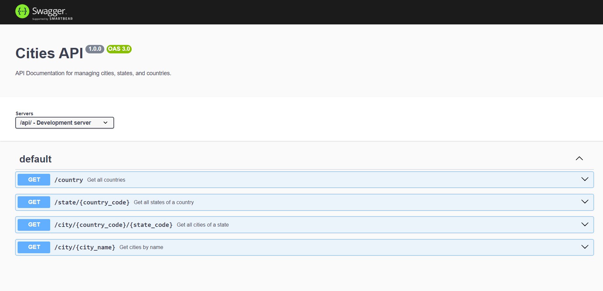

<h1 align="center">Cities API</h1>

[Projeto](#projeto)
&nbsp;&nbsp;&nbsp;|&nbsp;&nbsp;&nbsp;
[Tecnologias](#tecnologias)
&nbsp;&nbsp;&nbsp;|&nbsp;&nbsp;&nbsp;
[Licença](#license)

  

## 💻 Projeto 

  

Este projeto foi elaborado em sala de aula durante a disciplina de Técnicas Avançadas de Desenvolvimento de Software com linguagem focada em C#, porém fiz em Node JS.

A tecnologia escolhida foi também para praticar e aprender um pouco mais sobre ela e a construir uma API utilizando Express.

O Projeto se trata da uma construção de uma API para consulta de cidades, estados e paises e também a documentação da API utilizando o Swagger.

A "API externa" que fazemos consulta na verdade é um dataset fornecido pelo professor.

OBS: Não foi alterado nenhuma informação do dataset.

O Swagger optei por construir manualmente ao invés de utilizar o AutoGen pra geração automática.

 
 

## 🚀 Tecnologias 

- Node JS
- TypeScript
- Express
- Swagger
- TS-Node-Dev

 
 

## ✈️ Rotas

A aplicação foi hospedada no [Railway](https://railway.app) e feita a documentação dela com o Swagger e as rotas estão todas disponíveis para teste por lá.

URL: [cities-api-production.up.railway.app](cities-api-production.up.railway.app)

Swagger: [cities-api-production.up.railway.app/api-docs](cities-api-production.up.railway.app/api-docs)

## 🔒 Licença

Esse projeto está sob a licença MIT.

